 
## 查看主页获取源码

### 一、作品包含

源码+数据库+设计文档万字+全套环境和工具资源+部署教程

### 二、项目技术

前端技术：Html、Css、Js、Vue、Element-ui

数据库：MySQL

后端技术：Java、Spring Boot、MyBatis

  

### 三、运行环境

开发工具：IDEA

数据库：MySQL8.0

数据库管理工具：Navicat10以上版本

环境配置软件： JDK1.8+Maven3.6.3

前端Nodejs：16

### 四、项目介绍
项目编号：springbootA029

高校实验室管理系统是现代教育信息化建设的重要组成部分，它以提高实验室管理效率、优化资源配置、保障实验安全、促进实验教学和科研工作为核心目标。在新时代背景下，随着我国高等教育事业的快速发展，实验室作为培养学生实践能力和创新精神的重要场所，其管理工作显得尤为重要。高校实验室管理系统的建立，有助于实现实验室资源的规范化、科学化、信息化管理，为高校教育教学和科学研究提供有力支持。

学生功能: 登录、注册、查看实验室列表信息、实验室预约、查看预约进度并取消、查看公告、订阅课程、实验室报修、修改个人信息。

教师功能: 查看并审核预约申请、查看已审核预约并导出到excel、实验室设备管理、报修、查看实验室统计情况、略。

管理员功能: 用户管理、设备管理、实验室管理、耗材管理、包括增删查改、账户禁用等功能、查看并审核预约、查看报修信息、发布公告、发布课程，添加删除课程、查看实验室使用情况。

### 五、运行截图

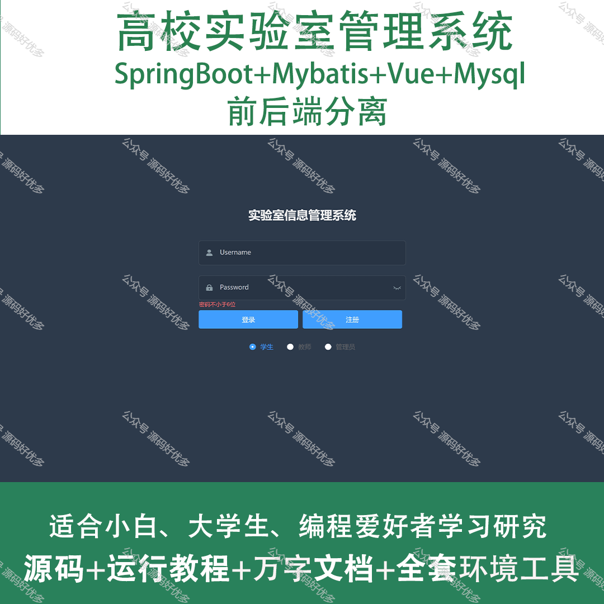
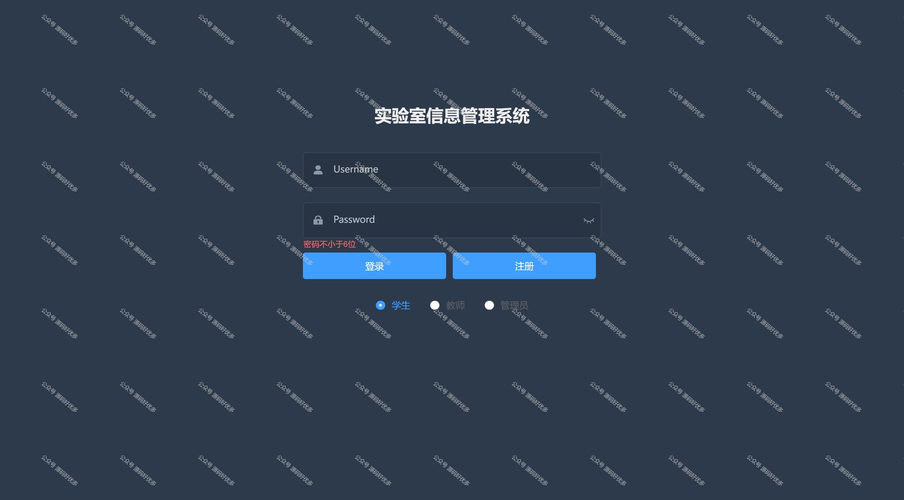
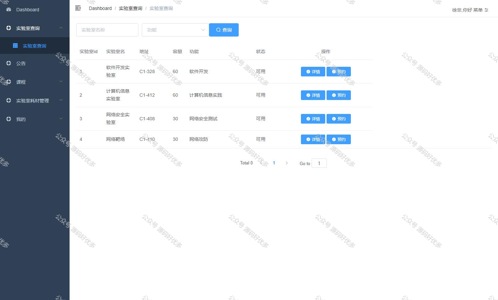
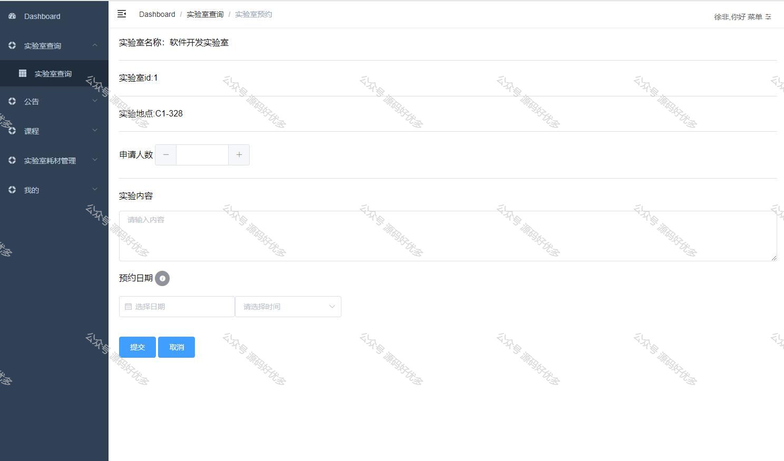
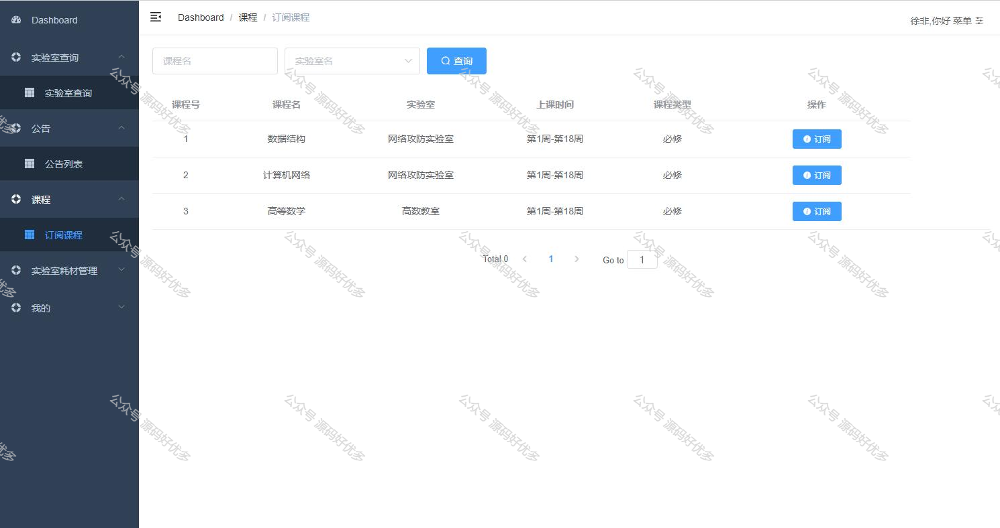
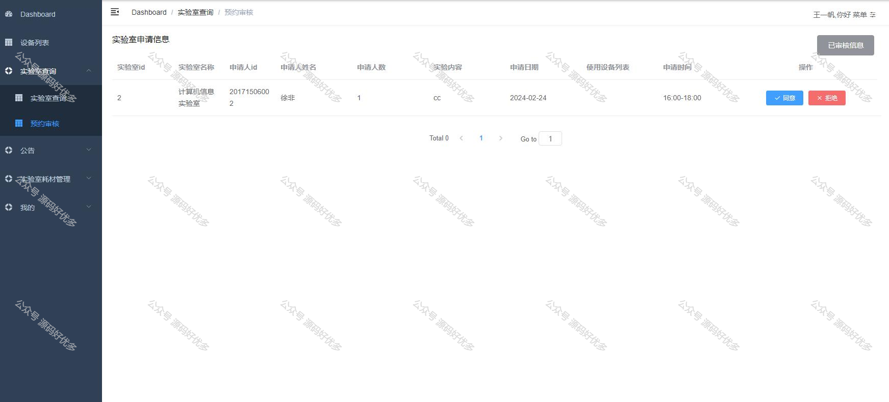
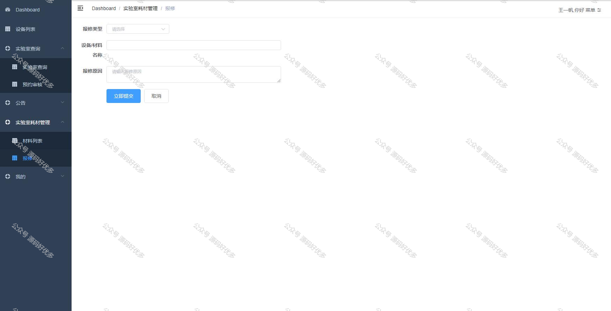
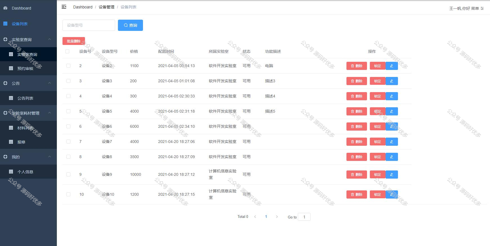
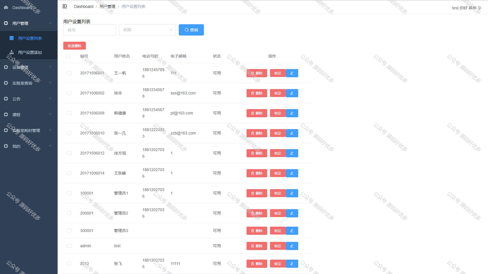
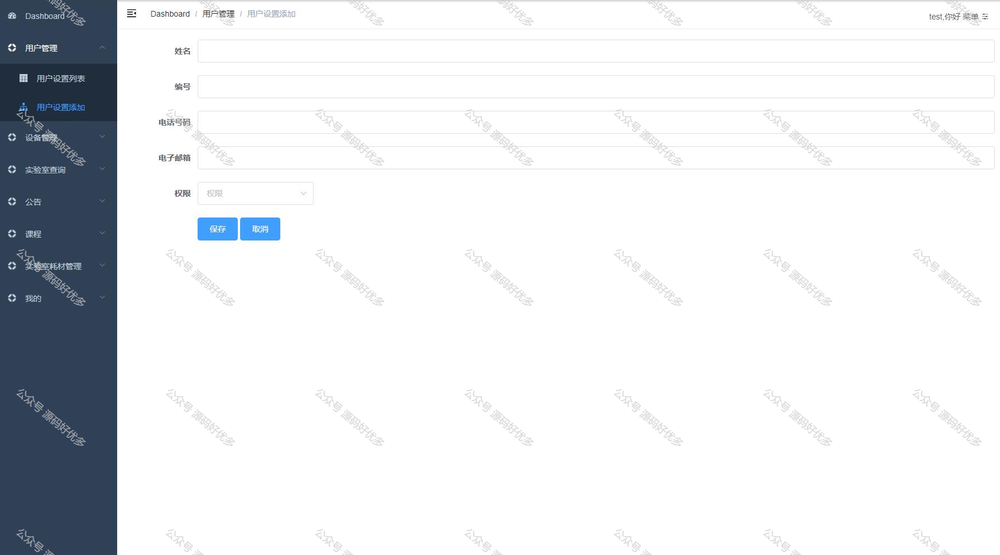
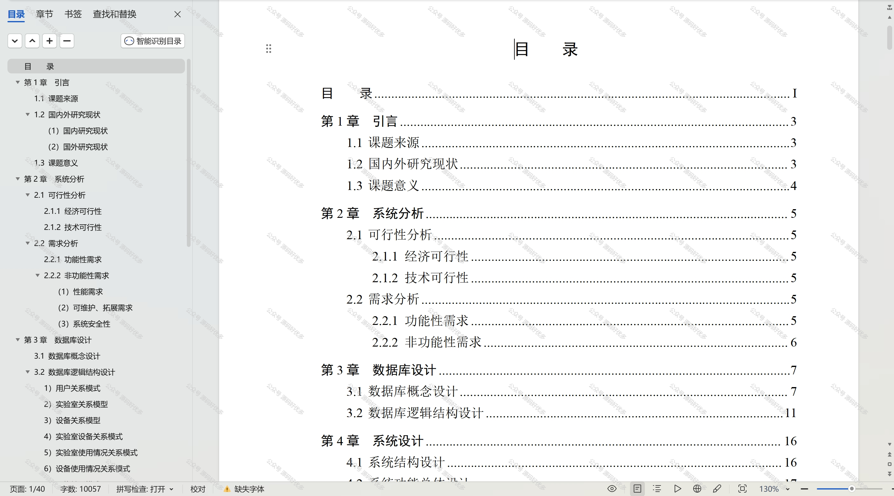

  
